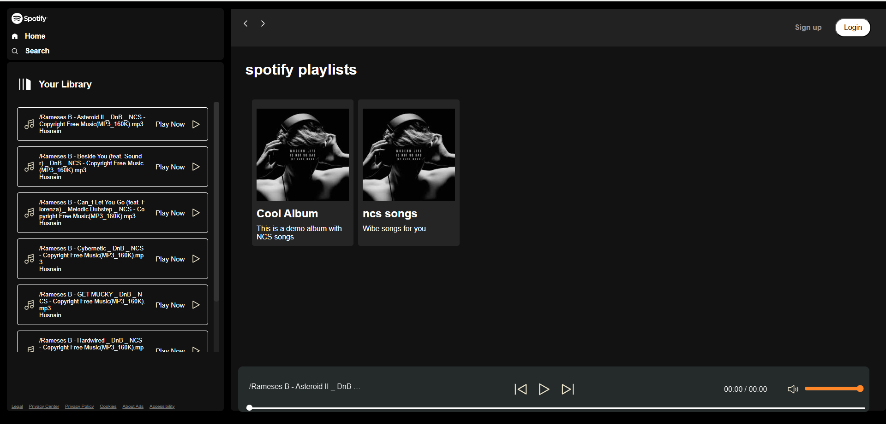

# Spotify / Music Player Clone 🎵

A Spotify-style music player UI clone built using **HTML, CSS, and JavaScript**.  
This project was **created following a tutorial by CodeWithHarry**, with additional custom features implemented by me.  

---

## 🚀 Features

- Responsive Spotify-style UI  
- Play songs from folders  
- Keyboard shortcuts (added by me):
  - **Arrow Up / Down** → Volume up / down
  - **Arrow Left / Right** → Skip 10 sec backward / forward
  - **Space** → Play / Pause
  - **M** → Mute / Unmute
- Dynamic album cards with cover image, title, and description  
- Clickable song list to play any song  
- Fully interactive and responsive player  

---

## 📂 Project Structure
spotify-music-clone/
- │── index.html # Main HTML page
- │── style.css # Main CSS styles
- │── utility.css # Utility classes for layout
- │── script.js # JavaScript logic for music player
- │── songs/ # Folder to store song folders
- │ └── <album-folder>/
- │ ├── song1.mp3
- │ ├── song2.mp3
- │ ├── cover.jpg
- │ └── info.json # Album metadata
- │── README.md

---


---

## 🎶 How to Add Songs / Albums

1. Inside the `/songs` folder, create a new folder for your album or song collection.  
   Example: `/songs/cool-album/`

2. Add your **NCS or non-copyrighted `.mp3` files** inside this folder.

3. Add a **cover image** named `cover.jpg` for the album (displayed in the card).

4. Add an `info.json` file for album metadata. Example structure:

```json
{
  "title": "Cool Album",
  "description": "This is a demo album with NCS songs"
}
```
---

## 🖼️ Screenshots


